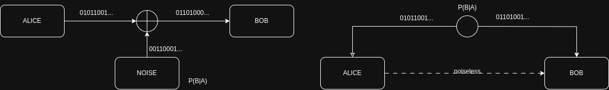
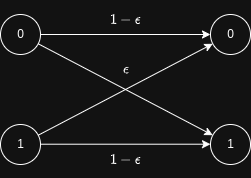
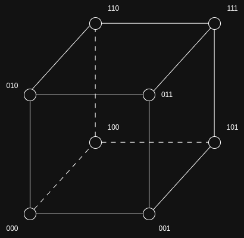
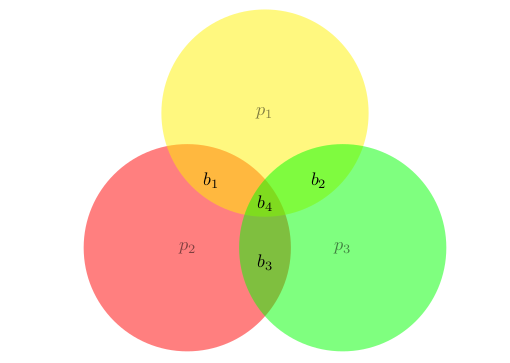
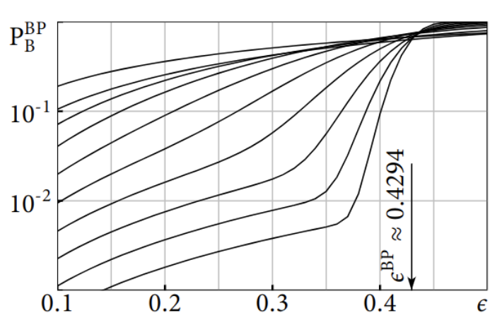
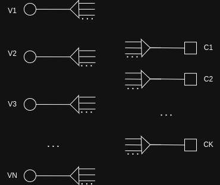
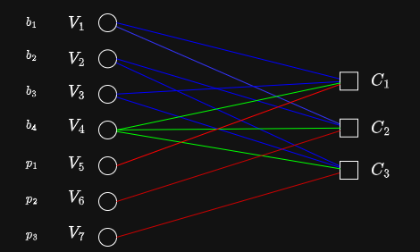
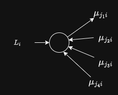
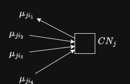

---
# You can also start simply with 'default'
theme: default
# random image from a curated Unsplash collection by Anthony
# like them? see https://unsplash.com/collections/94734566/slidev
background: './img/portal.png' #https://cover.sli.dev
# some information about your slides (markdown enabled)
title: Practical Error Correction and Privacy Amplification
info: |
  ## A deck of slides about postprocessing in QKD and practical AC and PA steps
# apply unocss classes to the current slide
class: text-center
# https://sli.dev/features/drawing
drawings:
  persist: false
# slide transition: https://sli.dev/guide/animations.html#slide-transitions
transition: slide-left
# enable MDC Syntax: https://sli.dev/features/mdc
mdc: true
---

# Practical Error Correction and Privacy Amplification

#### Marco Cofano - Head of Software LuxQuanta Technologies S.L.

  
    Press Space for next page <carbon:arrow-right class="inline"/>
  

  <button @click="$slidev.nav.openInEditor()" title="Open in Editor" class="text-xl slidev-icon-btn opacity-50 !border-none !hover:text-white">
    <carbon:edit />
  </button>
  <a href="https://github.com/marcocofano/qkd_reconciliation_lectures" target="_blank" alt="GitHub" title="Open in GitHub"
    class="text-xl slidev-icon-btn opacity-50 !border-none !hover:text-white">
    <carbon-logo-github />
  </a>

<!--
The last comment block of each slide will be treated as slide notes. It will be visible and editable in Presenter Mode along with the slide. [Read more in the docs](https://sli.dev/guide/syntax.html#notes)
-->

---
transition: fade-out
layout: two-cols-header
---

::header::
# Information reconciliation in QKD 

::left::
<v-clicks>

- After Quantum comms Alice and Bob share classical correlated strings.
- Eve has a (quantum) state with some side information (some correlations with Alice and Bob's data)
- Parameter Estimation: **QBER**, Excess noise, etc... A and B share and discard some samples
- Correctness: Some bits are disclosed. Bob tries to guess Alice data from his and the disclosed data
- Security: compute SKR  e.g.: (Devetak-Winter)
Symmetric randomness extraction to eliminate any remaining Side information Eve has
</v-clicks>
::right::

 
</img>

---
transition: fade-out
layout: two-cols-header
---

::header::
# Entropic quantities operational meaning

<Box title="Conditional Probability">

  $P(A|B)$ Probability distribution of A, knowing B's results. "The probability distribution of A's data according to B's knowledge"

</Box>

<Box title="Entropy">

  $H(A)$  Amount of bits we need to convey (describe) A's distribution. Maximum compression possible for A's data

</Box>

---
transition: fade-out
layout: two-cols-header
---

::header::
# Entropic quantities operational meaning

<Box title=" Conditional Entropy">

$H(A|B)$  Amount of bits B needs, if he wanted to describe A's distribution, according to Bob. Bob might have more data using his distribution which reveals some info about Alice. If A, B  are decorrelated $H(A|B) = H(A)$

</Box>

<Box title="Mutual Information">

$I(A, B)$ Information gain. Given that Bob has some info on A, he does not need H(A) bits to describe A, he needs H(A|B) bits. He gained

$$
I(A,B) = H(A) - H(A|B)
$$
    bits
</Box>

---
transition: fade-out
layout: two-cols-header
---

::header::
# Entropic quantities operational meaning

<Box title=" Conditional Min Entropy">

  $H_{min}(A|B)$ Max amount of random bits one can extract from a sample taken from distribution A, when B has side information.

</Box>
---
transition: fade-out
layout: two-cols-header
---

::header::
::left::

Devetak-Winter formula
<v-click>

$$
r_d = \max\{ 0 , \beta I(A;B) - \chi(A;E) \} \\
r_r = \max\{ 0 , \beta I(A;B) - \chi(B;E) \}  
$$

</v-click>

<v-click>

in practice: 

$$
  H_\text{min}(X^{k}| E) \sim h_{min}(\text{QBER})\, 
$$

$$
r = \frac{(N - N_{\text{PE}})h_{\text{min}} - \delta_{\text{leak}}}{N}
$$
  
$$
\delta_{\text{leak}} \ge H(A|B)
$$

</v-click>

::right::

 
</img>

---
transition: fade-out
layout: two-cols-header
---

::header::
# Error Correction / Reconciliation

::footer::

Two scenarios: 

- Lossy channel
- Asymmetric source coding with side information (only available at decoder) - Slepian Wolf

In both cases the goal is to have, after some procedure, the same string. 

<v-click>

<strong>What is the rate at which we can achieve it?</strong>

</v-click>

<v-click>

Practically: 

If they have a certain number of bits that we can use, how many of those do they need to sacrifice in order to be able to correct the differences

</v-click>

---
transition: fade-out
layout: two-cols-header
---

::header::
# Error Correction / Reconciliation

::footer::

The channel is characterized by the transition probability $P(B|A)$.

BSC channel: 

The transition probability is 

$$
P(B|A) = \begin{cases}
P(1|1) = 1 - \epsilon = P(0|0) \\
P(1|0) = \epsilon = P(0|1) \\		
\end{cases}
$$

---
transition: fade-out
layout: two-cols-header
---

::header::
# Error correction codes

::footer::

<v-click>

<Definition title="Code">

A <u>code</u> C of length $n$ and cardinality $|C|$ over a field $\mathbb{F}$ is a collection of $|C|$ elements from $\mathbb{F}^n$, i.e,

$$
C(n, M) = \{x^{[1]}, \dots, x^{[M]} \}, \quad x^{[c]} \in \mathbb{F}_p, \quad  1\le c\le |C|.
$$
</Definition>

The elements of the code are called <u>codewords</u> and the parameter $n$ is called <u>codelength</u>. 

</v-click>

<v-click>

<Definition title="Code Rate"> 

The <u>rate</u> of a code $C(n,M)$ is $R=\frac{1}{n}\log_{|\mathbb{F}|}|C|$. In Shannon terminology it is measured in information symbols per transmitted symbol.
</Definition>

in particular if $|C| = |\mathbb{F}|^{m}$, then: $R=\frac{m}{n}$

</v-click>
      
---
transition: fade-out
layout: two-cols-header
---

::header::
# Error correction codes

---
transition: fade-out
layout: two-cols-header
---

::header::

# MAP decoding

::footer::

<v-click>

- code $C(n,M) = \{x^{[1]}, \dots, x^{[M]}\}$ 
- transition probability $P_{Y|X}(y|x)$
- The source probability: $P_X(x)$
- Y is what the receiver observes
- The probability that we made an error is $1-p_{X|Y}(\hat{x}(Y)|y)$

</v-click>

<v-click>

<Definition title="Maximum a Priori decoder">
$$
\begin{split}
\hat{x}^{MAP}(y) &= argmax_{x \in C} \; p_{X|Y}(x|y) \\
&= argmax_{x \in C} \; p_{Y|X}(y|x)\frac{p_X(x)}{p_Y(y)} \\
\end{split}
$$
</Definition>

If all codewords are equally likely the Maximum a posteriori decoder (MAP) is equal to the Maximum likelihood decoder (ML) because $p_X(x)=\frac{1}{2}$.

</v-click>
---
transition: fade-out
layout: two-cols-header
---

::header::
# Channel theorems

::footer::

<v-click>

<Theorem  title="Shannon Channel Coding">

There exists a constant C called the Channel Capacity, depending on the transition probability of the channel (parametrized by $\epsilon$), such that if the rate is such that $0 \le r \le C(\alpha)$ then:
$$
\hat{P}^{MAP}_B(n, 2^{[rn]}, \epsilon) \rightarrow 0 \,for \, n \rightarrow 0.
$$
</Theorem>

</v-click>

<v-click>

The converse is also true, namely that if one attempts to decode with a code of rate greater that the Shannon Capacity it will incur in probabilities of error that are bounded away from zero.

</v-click>

<v-click>

The code rate for which (asymptotically) we can expect to decode is:
$$
R < C(\epsilon) = \max_X \left((H(Y) - H(Y|X)\right) = \max_X I(Y;X)
$$

</v-click>

---
transition: fade-out
layout: two-cols-header
---

::header::

# Slepian - Wolf Distributed Source Coding (1977)

Asymmetric source coding with side information only at the decoder

::footer::

<v-click>

- We have two correlated distributions A and B.
- A is only available at the encoder and B is only available at the decoder. 

</v-click>

<v-click>
<Box>
What is the best compression for A, knowing the correlation between the distributions?
</Box>

</v-click>

<v-click>
If they where uncorrelated it would be H(A), and H(B) resp. But knowing that they are correlated lowers the best encoding for A to:

$$
H(A|B) = H(A) - I(A,B)
$$

Bob only needs this amount of information to decode Alice string. This will produce two identical strings.

</v-click>

<v-click>
<Box>
IN QKD this side info is sacrificed to correct the rest:

$$
\delta_{\text{leak}} \ge H(A|B)
$$

</Box>

</v-click>

---
transition: fade-out
layout: two-cols-header
---

::header::

# Example 1: Uncoded transmission 

::footer::

Suppose that the transmitted bits over the BSC($\epsilon$) are independent and that
$$P \{X_t = +1\} = P \{ X_t = -1\} = \frac{1}{2} $$

We send the data as is. At the receiver, we estimate the transmitted bit X based on the observation Y: 
$$\hat{x}^{\text{MAP}}(y)$$

It is equivalent to maximizing $p_{Y|X}(y|x)$ for the given $x$. 

-  Since $\epsilon$ < 1, we conclude that the optimal estimator is $\hat{x}^{MAP}(y) = y$.

- The probability that the estimate differs from the true value, i.e., $P_b = P \{\hat{x}^{MAP}(Y) \neq X\}$, is equal to $\epsilon$. 

- Code Rate = 1

The probability of error is always bounded away from zero!

---
transition: fade-out
layout: two-cols-header
---

::header::

# Example 2: Repetition code

::footer::

<v-click>
Assume we repeat each bit k times. 

$$(x, \dots, x) \qquad \rightarrow \qquad Y_1 \dots, Y_k$$

The estimator that minimizes the bit-error probability is given by the
majority rule. (Convince yourself)

$$
\hat{x}^{MAP}(y_1, \dots, y_k) = \text{majority of } \{y_1, \dots, y_k \}.
$$

</v-click>

<v-click>
Hence the probability of bit error is given by

$$
P_b = P \{\hat{x}^{MAP}(Y) \neq X\}  = P\{\text{at least } \frac{k}{2} \text{ errors occur} \} = \sum_{i>\frac{k}{2}} \binom{k}{i}\epsilon^i (1-\epsilon)^{k-1}
$$

- rate $\frac{1}{k}$
- For $P_b$ to approach zero we have to choose k larger and larger and as a consequence the rate approaches zero as well.

</v-click>

---
transition: fade-out
layout: two-cols-header
---

::header::
# Repetition Codes - cont'd 

::left::

<Box title="Lossy channel">

$(000)$ and $(111)$ codewords are the correct ones. 
They are maximally distanced so that one error can be corrected. 

</Box>

::right::

---
transition: fade-out
layout: two-cols-header
---

::header::
# Repetition Codes - cont'd 

::left::

<Box title="Asymmetric source coding problem">

A and B have any 3 bits codes with equal probability, but correlated (that they differ only by one bit)

$$
(000, 111)
(001, 110)
(010, 101)
(100, 011)
$$

- They all differ by 3 bits. So the decoder can, knowing his string, decifer which one A holds. 

- Only reveal which group A is in to B: 2 bits

- Alice and Bob can reconcile 1 bit out of the three they share. 

</Box>

::right::

---
transition: fade-out
layout: two-cols-header
---

::header::
# Linear codes - Hamming

::left::

<v-click>

- We want to send a 4 bits message through a noisy channel. 

- We add three "parity bits" to protect the message bits

$x = (b_1, b_2, b_3, b_4, p_1, p_2, p_3)$

subject to the contraints

$$
\begin{align}
	      b_1 + b_3 + b_4 +p_1 = 0 \nonumber \\
	      b_1 + b_2 + b_4 +p_2 = 0  \nonumber \\
	      b_2 + b_3 + b_4 +p_3 = 0 \nonumber
\end{align}
$$

</v-click>

::right::
<v-click>

$$
Hx = 0
$$
where H is the parity check matrix:
$$
H = \left[\begin{matrix}
1 & 0 & 1 & 1 & 1 & 0 & 0 \\
1 & 1 & 0 & 1 & 0 & 1 & 0 \\
0 & 1 & 1 & 1 & 0 & 0 & 1
\end{matrix} \right]
$$
</v-click>

---
transition: fade-out
layout: two-cols-header
---

::left::
# Hamming decoding - Exercises

1. Can you reason about the Slepian-Wolf asymmetric source coding point of view, for Hamming Codes.
2. Can you extend the Hamming codes to more bits and different code rates?
Prove that:

- a general Hamming code has n = $2^k - 1$ and the number of systematic bits is: 

$$s = 2^k - k - 1$$

::right::

---
transition: fade-out
layout: two-cols-header
---

::header::
# Linear codes - General theory

::footer::
<Definition title="Linear code">

A linear code of length $n$ and dimension $k$ is a linear subspace $C$ with dimension $k$ of the vector space $\mathbb {F}_{q}^{n}$ where $\mathbb {F}_{q}$ is the finite field with $q$ elements.
The vectors in C are called codewords. The size of a code is the number of codewords and equals $q^k$.

</Definition>

<Definition title="Distance">

The (Hamming) distance between two codewords is the number of elements in which they differ

</Definition>

---
transition: fade-out
layout: two-cols-header
---

::header::
# Linear codes - H, G matrix, Syndrome

::footer::

<Definition title="G matrix">

  As a linear subspace of $\mathbb{F}_{q}^{n}$, the entire code C may be represented as the span of a set of k codewords. These basis codewords are often collated in the rows of a matrix G known as a $\textbf{generating matrix}$ for the code C. When G has the block matrix form $G=[I_{k}|P]$, where $I_{k}$ denotes the $k\times k$ identity matrix and P is some $k \times (n-k)$ matrix,  it is in **systematic form**.

</Definition>

<Definition title="H matrix">

A matrix H representing a linear function
$$
H :\mathbb {F}_{q}^{n} \to \mathbb {F}_{q}^{n-k},
$$
whose kernel, $\ker H = \{x \in \mathbb{F}^n_q: H x^T = 0\}$  is C is called a check matrix of C.

</Definition>

---
transition: fade-out
layout: two-cols-header
---

::header::
# Linear codes - H, G matrix, Syndrome

::footer::

<Definition title="Syndrome">

  Be $x \in \mathbb{F}_{q}^{n}$ 
$$
s = H \,x
$$
</Definition>

<Box title="Properties">

  - G and H are such that GH = 0.
  - There exist the following bijections: $\mathbb{F}_{q}^{n - k} \cong \mathbb{F}_{q}^{n} / im(G) \cong \mathbb{F}_{q}^{n} / \ker H$,
  - The total space $\mathbb{F}_{q}^{n}$ is partitioned into equivalence classes:

  two different codewords $y, y\prime \in \mathbb{F}_{q}^{n}$ that differ by a valid codeword $Gx \in im(G)$, namely $y\prime = y + Gx$ for some $x\in \mathbb{F}_{q}^{k}$ are mapped to the same syndrome by H and so they are in the same equivalence class.

</Box>

---
transition: fade-out
layout: two-cols-header
---

::header::
# Linear codes - Complexity Analysis

- Encoder 
- Description
- Decoder

---
transition: fade-out
layout: two-cols-header
---

::header::
# Linear codes - Encoder complexity

<v-click>

What is the number of operations needed to perform encoding?

</v-click>

<v-click>
If we encode using the G matrix (or an equivalent algorithm using H directly) we expect 

$$O(n^2)$$

operations.

</v-click>

<v-click>

[Richardson and Urbantke (2001)](https://ieeexplore.ieee.org/document/910579) proved that the optimal Encoding can be achieved in: 

$$O(n) + O(g^2)$$ 

with $g$ possibly small, if we cleverly desing a matrix H such that it is almost upper triangular with only g rows that are complete (have values above diagonal).

</v-click>

::notes::
<v-click>

Richardson, Thomas J, and Rüdiger L Urbanke. “Efficient Encoding of Low-Density Parity-Check Codes.” IEEE TRANSACTIONS ON INFORMATION THEORY. Vol. 47, 2001.

</v-click>

---
transition: fade-out
layout: two-cols-header
---

::header::
# Linear codes - Decoder complexity

<v-click>

The MAP decoding problem is, unfortunately, NP-Hard. 

</v-click>

::left::

<v-click>

- Suboptimal, but very good, iterative graph theory solutions.
- Fix Code Rate, for each $\epsilon$,  work at a certain distance to capacity. 
- Efficiency of Error correction ($\beta$, $f_{EC}$) 
$$
1 - R = f_{EC} \; H(A|B) = \delta_{\text{leak}} \\
R = \beta \; I(A,B)
$$
- Waterfall vs Error floor working points. 

Non idealities wrt Shannon Theorem. 
- Non-infinite codes
- non-optimal, iterative decoding (MAP is NP-Hard)

</v-click>

::right::

<v-click>
  

</v-click>

---
transition: fade-out
layout: two-cols-header
---

::header::
# Linear codes - Description Complexity Tanner Graph

<v-click>

the H matrix has $(1 - R)n^2$ entries. For binary matrices, one can cleverly (especially for sparse matrices) reduce the amount of data needed to describe it (and store it)

</v-click>

<v-click>

family of binary matrices with the same Code rate and performances can be described quite easily, through a bipartite graph. 

</v-click>

::left:: 

<v-click>
Tanner graph

- Each variable node (column) is a bit sent in the channel
- Each check node (row) computes the corresponding parity equation
- the edges connect each bit to the PC equations it belongs
- VN and CN have sockets with a number of edges going out

</v-click>

::right::

<v-click>

</v-click>

---
transition: fade-out
layout: two-cols-header
---

::header::
# hamming code tanner graph 

::left::

$$
\begin{align}
	      b_1 + b_3 + b_4 +p_1 = 0 \nonumber \\
	      b_1 + b_2 + b_4 +p_2 = 0  \nonumber \\
	      b_2 + b_3 + b_4 +p_3 = 0 \nonumber
\end{align}
$$

$$
H = \left[\begin{matrix}
1 & 0 & 1 & 1 & 1 & 0 & 0 \\
1 & 1 & 0 & 1 & 0 & 1 & 0 \\
0 & 1 & 1 & 1 & 0 & 0 & 1
\end{matrix} \right]
$$

<v-click>

$$
R = \frac{n - k}{n} =  \frac{7 - 3}{7} = \frac{3}{4}
$$

- degree of CN = $[4, 4, 4]$
- degree of VN = $[2, 2, 2, 3, 1, 1, 1]$

</v-click>

::right::

---
transition: fade-out
layout: two-cols-header
---

::header::
# Regular and irregular codes 

::left::

Regular codes $C(n, j, l)$

- j edges per VN, l edges per CN
- have a high degree of constraints, (the number of check nodes is inferred from $(n, j, l)$
  
- easy to design. Poorer performance

::right::

Irregular Codes

- relax the constraint on the degree distribution
- can perform better
- harder to design

::footer::

<v-click>

Regular code, Code rate:

The code rate can be completely inferred from the degree distribution. 

For a regular code $C(j, l)$, the number of edges can be computed from VN and CN and need to match:

$$
nj = kl
$$

$$
R = 1 - \frac{k}{n} = 1 - \frac{j}{l}
$$

</v-click>

---
transition: fade-out
layout: two-cols-header
---

::header::
# Low Density Parity Check codes

::footer::
They were invented by [Gallager (1963)](https://ieeexplore.ieee.org/document/1057683), with a construction of regular codes that had a low density. 

Regular codes edges scale linearly with the size of the code $n$.  
Gallager introduced an iterative decoder whose main computation depends on the edge count. 

Also irregular codes can be designed so that they are LDPC.

<Box title="Advantages of low density and linear scaling">

- Faster Decoder
- Can perform very close to channel capacity
- Simpler to store (less resources)
- Sparse matrices have optimized algebraic algorithms

</Box>

::notes::

Gallager, R. “Low-Density Parity-Check Codes.” IRE Transactions on Information Theory 8, no. 1 (1962): 21–28. https://doi.org/10.1109/TIT.1962.1057683.

---
transition: fade-out
layout: two-cols-header
---

::header::
# Belief Propagation Decoder

::left::

<v-click>

- we input our belief about every bit (Variable Nodes): 

What is $P(B|A = 1)$ compared to $P(B|A=0)$? This will be our message that we send into the graph. 

</v-click>

<v-clicks>

- we repeat this message and send it to each connected CN
- there we update this belief in such a way that the parity  check equations are satisfied. 
- we resend it back to VN where we collect all the different updates for the same bit. We update the bit probability belief from all the edges
- from the current beliefs we extract the bit value, 0 or 1 if the updated probability of being 0 was more that being 1

</v-clicks>

::right::

<v-click>

- if the guessed bits satisfy the parity check equations we exit, otherwise we continue updating. 

</v-click>

---
transition: fade-out
layout: two-cols-header
---

::header::
# Bipolar representation

::footer::

Map $(0, 1) \rightarrow (1, -1)$

$$
P(Y=y | X = 0) = P(Y=y | \ddot{X} = 1)
$$

<Definition title="Log-likelihood">

$$
L(X) = \ln\left(\frac{P(\ddot{X} = 1)}{P(\ddot{X} = -1)}\right), \;

L(X|Y) = \ln\left(\frac{P(\ddot{X} = 1|Y)}{P(\ddot{X} = -1|Y)}\right)
$$

</Definition>

-  logs compress the values. Avoids numerical instabilities in computer code
-  No normalization of probabilities needed
-  They will be easy to compute (linear in the received bits)
-  The multiplications will be substituted by additions (faster on a computer)
-  Log are monotones so: if $L > 0 \rightarrow P(X=0) \ge P(X=1)$
-  The sign of $L$ tells the most probable binary value, the magnitude the reliability of the choice

---
transition: fade-out
layout: two-cols-header
---

::header::
# LLR examples

::footer::
<Box title="BSC">

For the BSC of crossover probability $\epsilon$: 
$$
L(Y=y|X) = \ln\left(\frac{1-\epsilon}{\epsilon}\right) \ddot{y}
$$
</Box>

<Box title="BiAWGN">

From a BiAWGN channel with variance $\sigma^2$
$$
L(Y=y|X) = \ln \left(\frac{2}{\sigma^2}\right)\ddot{y}
$$
</Box>

---
transition: fade-out
layout: two-cols-header
---

::header::
# LLR examples

::footer::

To convert back to probabilities:

$$
L(X) = \ln\left(\frac{P(\ddot{X} = 1)}{P(\ddot{X} = -1)}\right) \\ 
e^{L(X)} = \frac{P(\ddot{X}=1)}{1-P(\ddot{X}=1)} \\
P(\ddot{X} = \ddot{x}) = \frac{1}{1+e^{-\ddot{x}L(\ddot(X))}}
$$

The expectation value of $\hat{x}$ in terms of the LLR:

$$
E(\ddot{x}) = P(\ddot{X}=1) - P(\ddot{X}=-1) \\ 
 =  1 - 2P(\ddot{X}=1) \\
 = \tanh\left(\frac{L(\ddot{X})}{2}\right)
$$
---
transition: fade-out
layout: two-cols-header
---

::header::
# Belief propagation: VN update

::left::

- the messages coming from the check nodes update the LLR for each VN
- a VN is like a repetition code of one bit. We send, repeated with uniform probability the same bit
- LLRs update involve summing (Bayes rule with uniform prior).

$$
L(X|y) = L(y|X)
= \sum_{i=1}^n \ln \left(\frac{P(y_i|X=0)}{P(y_i|X=1)}\right)
= \sum_{i=1}^n L(y_i|X)
$$

- it can be argued then that the update rule is:

$$
\mu_{i \rightarrow j}^{(l)} = 
L_i + \sum_{j' \in N(i)\setminus\{j\}} \mu_{j' \rightarrow i}^{(l)}.
$$

where the sum runs over all incident edges apart from the one under update

::right::

---
transition: fade-out
layout: two-cols-header
---

::header::
# Belief propagation: CN update
This needs a bit more work. 

::footer::

<Theorem title="Gallager">

  Consider a binary sequence such that the probability that the l-th bit is 1 is $P_l$. The probability that the sequence has an even number of 1's is:

$$
P = \frac{1}{2}\left(1 + \prod_{l=1}^{k}(1 - 2P_l)\right)
$$

</Theorem>

---
transition: fade-out
layout: two-cols-header
---

::header::
# Belief propagation: CN update

::footer::
Single Check Code

Consider a code with only one parity check and $n$ transmitted bits

The MAP decoder for such a code tells us that, for any message bit:

$$
\hat{x}_1 = \arg \max P(x_1=b|y, \text{even number of 1s})
$$

We can re arrange the formula and use Gallager theorem:

$$
P(x_1=0|y, \text{even number of 1s}) = 
P(x_2, \dots x_n  \text{even number of 1s}| y)  \\
= \frac{1}{2}\left(1 + \prod_{l=2}^{k}(1 - 2P(x_l=1|y_l))\right) \\
= 1 - P(x_1=1|y, \text{even number of 1s})
$$

$$
1 -2P( x_1=1|y, \text{even number of 1s}) = 
\prod_{l=2}^{k}(1 - 2P(x_l=1|y_l))
$$

---
transition: fade-out
layout: two-cols-header
---

::header::
# Belief propagation: CN update

::footer::

we can rewrite it in terms of LLRs:

$$
L(x_1|y, \text{even number of 1s}) = 
2\tanh^{-1} \left(\prod_{l=2}^n\tanh\left( \frac{L(x_l|y_l)}{2}\right)\right)
$$

---
transition: fade-out
layout: two-cols-header
---

::header::
# Belief propagation: Sum Product algorithm

::footer::
We can finally state a complete algorithm for the iterative decoding of a Linear Code. 

<Definition title="Connection Node sets">

Let us define the sets of connections in the bipartite graph representing the LDPC code:

$$
N(i) \qquad \text{Set of check nodes connected to the variable node i.} \\
M(j) \qquad \text{Set of variable nodes connected to the check node j}
$$

</Definition>

---
transition: fade-out
layout: two-cols-header
---

::header::
# Belief propagation: Sum product algorithm

::left::

Step 1: Initialization (Variable Nodes)

Initialize messages from each variable node $i$ to each check node $j \in N(i)$:
$$
\mu_{i \rightarrow j}^{(0)} = L_i,
$$
where $L_i$ is the Log-Likelihood Ratio (LLR) for the received bit associated with node $i$.

Step 2: Check Node Update

Compute the message from each check node $j$ to variable node $i \in M(j)$ at iteration $l$:
$$
\mu_{j \rightarrow i}^{(l)} =
2\,\tanh^{-1}
\left(
\prod_{i' \in M(j)\setminus\{i\}} 
\tanh\left(\frac{\mu_{i' \rightarrow j}^{(l-1)}}{2}
\right)
\right).
$$

::right::

Step 3: Variable Node Update

Compute updated messages from each variable node $i$ to each check node $j \in N(i)$:
$$
\mu_{i \rightarrow j}^{(l)} = L_i + \sum_{j' \in N(i)\setminus\{j\}} \mu_{j' \rightarrow i}^{(l)}.
$$

Step 4: Total Final LLR and Check

Compute the final LLR for each variable node $i$:
$$
L_i^{\text{total}} = L_i + \sum_{j \in N(i)} \mu_{j \rightarrow i}^{(l)}.
$$

Estimate transmitted bits $\hat{x}_i$ as:
$$
\hat{x}_i = 
\begin{cases}
    0, & \text{if } L_i^{\text{total}} \geq 0,\\[6pt]
    1, & \text{otherwise.}
\end{cases}
$$

- Continue until $H \,\hat{x}_i = 0$ successful decoding or max iteration

---
transition: fade-out
layout: two-cols-header
---

::header::
# Back to QKD: syndrome decoding

::footer::
We have seen the algorithm for normal error correction. It is not hard to see that the same algorithm would work for syndrome decoding with a very minimal change. 

<Box title="Exercise: SPA Syndrome Decoding">

Can you go through the sketch proof of the SPA algorithm and see what needs to be changed in order for Bob to decode to the syndrome provided by Alice instead of decoding for a valid codeword?

Hint: normal SPA decoding is basically syndrome decoding to the all zero syndrome.

</Box>

---
transition: fade-out
layout: two-cols-header
---

::header::
# Back to QKD: syndrome decoding

::footer::
In the context of QKD we would like to perform Slepian Wolf Asymmetric source coding.

This amounts to do Syndrome Decoding instead of adding parity bits and decode to the zero syndrome.

<Box title="Protocol">

  1. Alice and Bob, according to the estimated QBER, select the best matrix and code rate and share this info.
  2. Alice computes the syndrome of her own data and sends it to Bob. (Direct Reconciliation)
  3. Bob Decodes his data to the closest string inside the coset determined by Alice Syndrome.
  4. Bob sends Alice the index of the frames that have been decoded correctly (according to him)
  5. Alice and Bob verify up to a certain probability their EC data, using a hash of their corrected data. (EC verification)
</Box>

---
transition: fade-out
layout: two-cols-header
---

::header::
# Cyles, Trees and optimality of the decoder

::footer::

<Box title="SPA Assumptions">

1. it is a bitwise MAP decoding
2. the codebits are independent and identically distributed
3. the messages are independent

</Box>

Critically the 3. is never met.

While computing updates of the messages, the decoders eventually meets some node that was already met before. All practical codes have cycles. 

<Box>

- SPA implements bitwise MAP decoder optimally only for cycle free codes
- Codes without cycles (Tanner graph is a tree) have a lot of weight 2 (= min distance 2) codewords

</Box>

---
transition: fade-out
layout: two-cols-header
---

::header::

# Further knowledge

- According to a QBER, we choose a fixed matrix with a certain code rate = certain gap to capacity (efficiency) 
- If the channel QBER is not stable or we do not have enough matrices: adaptive EC, puncturing-shortening
- Verification step, hash functions and $\epsilon$ security. Protocol is secure up to a certain small probability
- Reverse reconciliation: It might be more efficient if Alice tries to guess Bob's data. 
e.g. In CV - QKD with direct reconciliation DR cannot extract secure keys in a scenario where the losses in the channel are more that 3dB (15 km)
